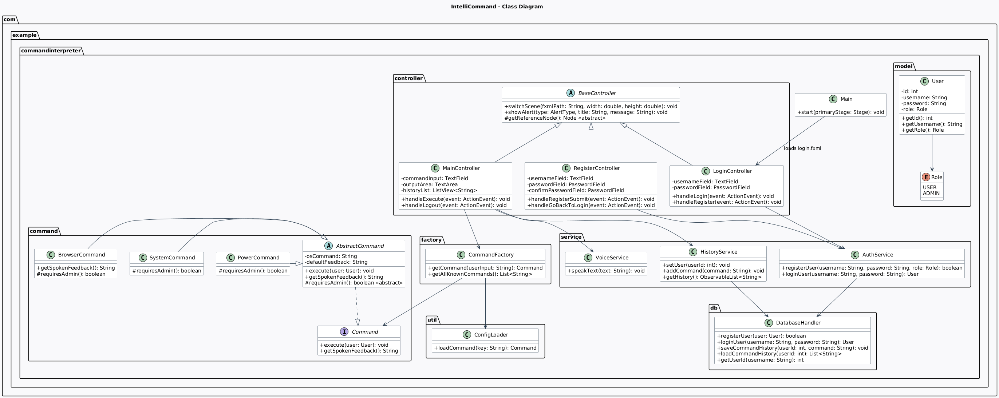

IntelliCommand – Intelligent Command Interpreter

IntelliCommand is a sophisticated desktop application that empowers users to control their computer through intuitive natural language commands. Simply type phrases like "open YouTube", "increase brightness", or "shutdown PC", and watch as the app executes them seamlessly. Built with a focus on security, extensibility, and user experience, it's your gateway to smarter computing, blending modern design with powerful functionality.
Whether you're boosting productivity or exploring command-line magic in a friendly interface, IntelliCommand makes it effortless and secure.

## FEATURES:

-Natural Language Command Execution
   Interpret and run everyday commands in plain English, from opening websites (YouTube, Google, WhatsApp Web) to system controls (brightness, notepad, calculator) and advanced actions (shutdown, restart, lock screen). Supports dozens of built-in commands out of the box.
-Robust User Authentication
   Secure registration and login system with BCrypt-hashed passwords and role-based access (User vs. Admin for sensitive commands).
-Persistent Command History
   Commands are logged per user in a MySQL database, displayed in a clean sidebar for easy review and reuse.
-Dynamic Command Loading
   Extensible via JSON configuration, add or customize commands without changing code.
-Elegant JavaFX Interface
   Clean, centered layouts with rounded elements, gradients, and responsive design. Includes quick-action buttons for common tasks.
-Database Integration
   MySQL-backed storage for users and history, ensuring data persistence across sessions.

## TECH STACK:

Java 25 – Cutting-edge language features for performance and security
JavaFX 25 – Rich, cross-platform UI framework for a polished desktop experience
MySQL – Reliable relational database for user data and command logs
Maven – Streamlined build and dependency management
jBCrypt – Industry-standard password hashing for enhanced security
JSON – Flexible configuration for dynamic commands

## PROJECT STRUCTURE:

com.example.commandinterpreter
├── command         → Command interface, AbstractCommand, implementations (BrowserCommand, SystemCommand, PowerCommand)
├── controller      → LoginController, RegisterController, MainController, BaseController
├── db              → DatabaseHandler for MySQL operations
├── factory         → CommandFactory for creating commands dynamically
├── model           → User and Role entities
├── service         → AuthService (authentication), HistoryService (command logging)
├── util            → ConfigLoader for JSON-based command extensions
├── Main.java       → Application entry point
├── fxml files      → login.fxml, register.fxml, main.fxml (UI layouts)
└── styles.css      → Custom CSS for styling

## CLASS DIAGRAM


## SCREENSHOTS
(Coming soon)

Login interface: 
Register interface:
Dashboard(main interface):

## GETTING STARTED:
Ready to try IntelliCommand? Follow these simple steps to get it running locally.

## PREREQUISITES
-Java JDK 25
- MySQL Server (running locally)
- Maven (for building)
 
## SETUP AND RUN
-Clone the repository:
```bash
   git clone https://github.com/marwakhan-sa/IntelliCommand---Smart-Laptop-Command-System.git
   cd IntelliCommand---Smart-Laptop-Command-System
   ```
-Set up MySQL database:
Run the SQL script in DataBase.txt to create the database, users table, and sample data.
Update credentials in DatabaseHandler.java if needed (URL, USER, PASS).

-Build and run:
Register a new user or login with test credentials (e.g., username: "testuser", password: "testpass").
Start typing commands in the main screen!

## FUTURE PLANS:

-Offline Voice Input → Integrate speech-to-text for hands-free command entry using Vosk
-Custom User Commands → Enable users to define and save personalized shortcuts
-Standalone Desktop Application → Package as executable installers (.exe, .dmg, .deb) for seamless distribution without Java setup
-Admin Panel → Advanced user management, command analytics, and monitoring
-Cross-Platform Enhancements → Optimize for Windows, macOS, and Linux with native integrations

Crafted with innovation for effortless command mastery.

If this project sparks your interest, star it on GitHub! 
Contributions are encouraged.let's evolve IntelliCommand together.

## CONTRIBUTORS

**Marwa Sajjad** [](https://github.com/marwakhan-sa)
**Sana Khawaja** [](https://github.com/sanaa-kh-37)

